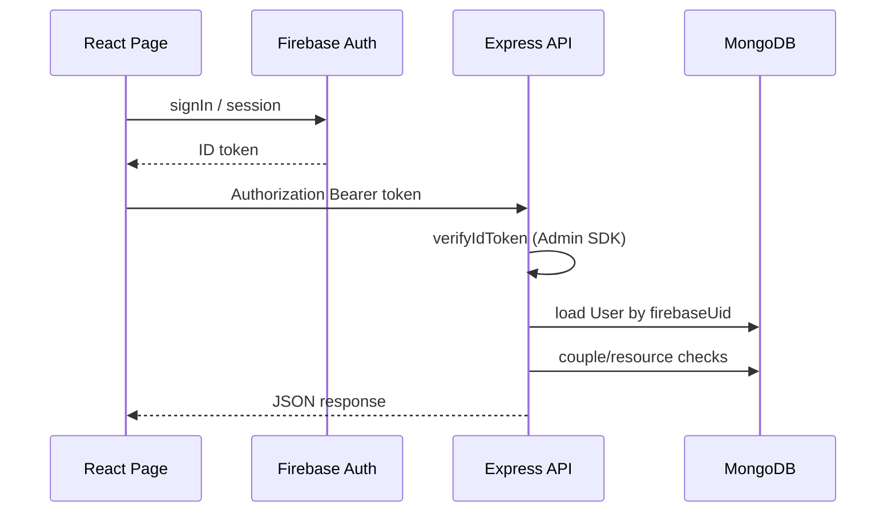

# CoupleLife OS — Authentication Architecture

Every protected feature follows the same contract so requests are always tied to the signed-in user.

## Stack map

| Layer               | Monorepo (`frontend/` + `backend/`)                       | Legacy Next (`client/` + `server/`)                     |
| ------------------- | --------------------------------------------------------- | ------------------------------------------------------- |
| Firebase client     | `frontend/src/firebase/firebaseConfig.js`                 | `client/src/lib/firebase.js`                            |
| Auth headers        | `frontend/src/lib/authFetch.js` + `api/client.js` (Axios) | `client/src/lib/authHeaders.js` (`authFetch`)           |
| Token verify        | `backend/src/middleware/firebaseAuth.js` + `jwtAuth.js`   | `server/src/middleware/auth.js` (`verifyFirebaseToken`) |
| Sync user → MongoDB | `POST /api/v1/auth/sync`                                  | User doc on first API use (`firebase_uid`)              |
| Route guard (UI)    | `ProtectedRoute` + `useRequireAuth()`                     | `auth.onAuthStateChanged` in pages                      |

## Request flow

## Backend rules (`/api/v1`)

1. **Public**: `GET /health`, `POST /auth/sync` (Firebase token only).
2. **Protected**: `router.use(verifyAuth, requireSyncedUser)` on users, couples, moods, expenses, bucket-list, trips.
3. **Couple-scoped data**: controllers call `getCoupleForUser(req.user)` — verifies `coupleId` membership before reads/writes.
4. **Chat / files**: Firebase Firestore + Storage on the client; MongoDB stores `firebaseChatRoomId` on the Couple model.

## Frontend rules

1. Wrap app routes with `ProtectedRoute` (redirects to `/login`).
2. Call `useRequireAuth()` at the top of sensitive pages (defense in depth).
3. Use `apiClient` or `authFetch` — never plain `fetch` without a token.
4. After sign-in, `FirebaseContext` calls `/auth/sync` and stores the app JWT in `localStorage`.

## Feature → API endpoints

| Feature     | Endpoints                                                              | Auth                            |
| ----------- | ---------------------------------------------------------------------- | ------------------------------- |
| Dashboard   | `GET /users/me`, `GET /moods/stats`                                    | Synced user                     |
| Moods       | `POST /moods`, `GET /moods/weekly`, `/calendar`, `/partner-comparison` | Couple member                   |
| Expenses    | `GET/POST /expenses`                                                   | Couple member                   |
| Bucket list | `GET/POST /bucket-list/items`                                          | Couple member                   |
| Trips       | `GET/POST /trips`                                                      | Couple member                   |
| Chat        | Firestore `chatRooms/{id}/messages`                                    | Firebase rules + couple room id |
| Landing     | —                                                                      | Public                          |

## Legacy server (`server/`)

Same pattern for the Next.js app:

- `GET/POST /api/expenses`
- `GET/POST/PATCH/DELETE /api/bucketlist`
- `GET/POST /api/trips`
- Moods: `/api/moods/*` (already implemented)

All use `verifyFirebaseToken` and compare `req.user.uid` to resource `owner_id` / `couple_id`.

## Adding a new feature

1. Mongoose model under `backend/src/models/`.
2. Service + controller with `getCoupleForUser` where shared.
3. Route file: `verifyAuth` + `requireSyncedUser`.
4. Frontend: `api/*.js` + hook + page with `useRequireAuth()`.
